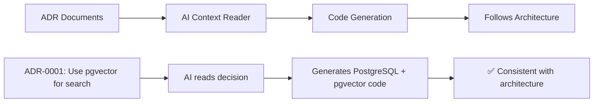

# 🌌 KRINS-Universe-Builder - The Ultimate AI Development Universe

🚀 **The ultimate AI universe builder with quantum computing, blockchain, and autonomous system creation**

> Transform any codebase into an intelligent, self-optimizing development environment with AI-powered assistance, automatic deployment, and team coordination.

## 🌟 Why This Changes Everything

**Traditional Development:** Hours of setup → Manual coding → Testing headaches → Deployment stress  
**KRINS-Universe-Builder:** `krins build "social media app"` → **30 minutes → Production ready app** ✨

### 🎯 **The Problem We Solve**
- ❌ Multiple disconnected AI tools requiring manual coordination  
- ❌ Hours spent on boilerplate, configuration, and deployment setup
- ❌ No quality gates - code breaks in production
- ❌ Team coordination chaos with multiple developers

### ✅ **Our Revolutionary Solution**  
- ✨ **Autonomous AI Teams** - Claude + GPT-4 + Gemini working together optimally
- ✨ **Zero-Config Magic** - From idea to deployed app in minutes
- ✨ **Quality Pipeline** - Automatic syntax, testing, and security validation
- ✨ **Real-time Collaboration** - Multi-developer coordination with conflict prevention
- 🧠 **ADR-Aware AI** - Reads architectural decisions and follows team standards automatically

**Result:** Build entire universes of systems with cutting-edge AI technology! 🚀

[](https://opensource.org/licenses/MIT)
[](https://github.com/mandymgr/claude-code-coordination)

## 🌌 **KRINS-Universe-Builder Capabilities**

> 📁 **NEW ARCHITECTURE**: Capabilities are now organized in dedicated directories for better navigation and management!

### 🗂️ **CAPABILITY DIRECTORIES:**
- **🏗️ [SYSTEM_BUILDING/](./SYSTEM_BUILDING/)** - Magic CLI and project generation
- **🤖 [AI_AUTOMATION/](./AI_AUTOMATION/)** - Multi-AI coordination and automation
- **📊 [ENTERPRISE/](./ENTERPRISE/)** - Production infrastructure and security
- **🔬 [ADVANCED_TECH/](./ADVANCED_TECH/)** - Quantum, blockchain, and ML
- **📈 [MONITORING_ANALYTICS/](./MONITORING_ANALYTICS/)** - Dashboards and metrics
- **🔧 [DEVELOPMENT_TOOLS/](./DEVELOPMENT_TOOLS/)** - Quality pipeline and testing

### 🏗️ **SYSTEM BUILDING:**
- **Magic CLI** - `krins build "social media app"` → komplett system på 30 min
- **VS Code Extension** - `apps/extension/` "Create Project from Prompt" med templates
- **Template System** - `templates/` forhåndsdefinerte project templates
- **AI-Orchestrated Building** - `packages/ai-core/` multi-AI teams koordinerer system-bygging
- **Full-Stack Generation** - Frontend + Backend + Database automatisk

### 🤖 **AI & AUTOMATION:**
- **Multi-AI Provider Support** - `packages/ai-core/` Claude + GPT-4 + Gemini koordinering
- **Intelligent Task Distribution** - `packages/ai-core/src/team-optimization-ai.cjs` ML-basert optimalisering
- **ADR-Aware Code Generation** - `packages/ai-core/src/adr-context-reader.ts` leser arkitektur-beslutninger
- **Context-Aware Development** - Forstår project-struktur og følger patterns
- **Automated Refactoring** - `packages/ai-core/src/` AI-powered code improvements

### 📊 **ENTERPRISE:**
- **Production Infrastructure** - `infra/` Docker + Kubernetes + monitoring
- **Multi-Tenant Architecture** - `apps/backend/src/services/enterprise/multiTenant.ts` isolerte environments
- **Enterprise SSO** - `apps/backend/src/services/enterprise/enterpriseSSO.ts` SAML 2.0, OIDC
- **Zero-Trust Security** - `apps/backend/src/services/security/zeroTrustService.ts` end-to-end encryption
- **Load Balancing & Auto-scaling** - `infra/kubernetes/` production-ready deployment

### 🔬 **ADVANCED TECH:**
- **Quantum Computing** - `apps/backend/src/services/quantum/` IBM Quantum, Google, simulators
- **Blockchain & Web3** - `apps/backend/src/services/blockchain/` multi-chain, smart contracts, DeFi, NFTs
- **Neural Architecture Search** - `apps/backend/src/services/automl/` AutoML med evolutionary algorithms
- **Voice & NLU Interface** - `apps/backend/src/services/voice/` multi-provider STT/TTS, intent recognition
- **Mobile SDK** - `packages/mobile-sdk/` React Native med offline-first architecture

### 📈 **MONITORING & ANALYTICS:**
- **Real-time Dashboard** - `apps/frontend/` React-basert visuelt grensesnitt
- **Performance Metrics** - `apps/backend/src/services/analytics/` success rate tracking, token usage
- **Business Intelligence** - `apps/frontend/src/sections/ExecutiveDashboard.tsx` ROI tracking, cost analysis
- **Grafana Integration** - `infra/monitoring/grafana/` production monitoring og alerting
- **Telemetry & Observability** - `apps/backend/src/utils/telemetry.ts` comprehensive insights

### 🔧 **DEVELOPMENT TOOLS:**
- **Quality Pipeline** - `apps/extension/src/qualityGateProvider.ts` build/syntax + test-impact + SAST
- **Automated Testing** - `tests/` unit, integration, E2E testing
- **Security Scanning** - `apps/backend/src/services/security/threatDetectionService.ts` secret detection, compliance
- **WebSocket Collaboration** - `packages/ai-core/src/realtime-hub.cjs` real-time team coordination
- **File Locking System** - `apps/extension/src/commands/toggleFileLock.ts` conflict prevention

## 🌊 The Krins Revealed

### From Idea to Production in Minutes

```
👩‍💻 DEVELOPER INTENT
    ↓ "Build me a social media app"
🌊 KRINS CLI ORCHESTRATOR
    ↓ Analyzes, plans, assembles AI team
┌─────────────────────────────────────────────────────────┐
│                 🤖 AI TEAM LAYER                        │
├──────────────┬──────────────┬──────────────┬───────────┤
│   CLAUDE     │    GPT-4     │   GEMINI     │COORDINATION│
│Frontend/UX   │Backend/Logic │DevOps/Deploy │ MANAGER   │
│Specialist    │Architect     │Engineer      │           │
└──────────────┴──────────────┴──────────────┴───────────┘
    ↓              ↓              ↓              ↓
┌─────────────────────────────────────────────────────────┐
│               🔧 INTEGRATION LAYER                      │
├─────────────┬─────────────┬─────────────┬──────────────┤
│  VS CODE    │  BACKEND    │ DASHBOARD   │  QUALITY     │
│ EXTENSION   │  SERVER     │   (WEB)     │  PIPELINE    │  
│File Locking │WebSocket Hub│Live Metrics │Auto Testing  │
│Diff Preview │AI APIs      │Team Status  │Security Scan │
│Quality Gate │Database     │Visualizations│Deploy Gates  │
└─────────────┴─────────────┴─────────────┴──────────────┘
    ↓              ↓              ↓              ↓
☁️ DEPLOYMENT TARGETS: Vercel | Netlify | AWS | Docker

🎉 RESULT: Full-stack app deployed in 30 minutes
```

## ✨ Core Features

- 🤖 **Autonomous AI Team Building** - Complete projects from description using orchestrated AI teams
- 📝 **VS Code Integration** - Rich extension with file locking and real-time collaboration
- 💬 **Multi-AI Orchestration** - Claude, GPT-4, and Gemini working together optimally
- 🔄 **Real-time Coordination** - WebSocket-based multi-user development
- 📋 **Quality Pipeline** - Syntax, testing, and security validation before apply
- 🌐 **Universal Deployment** - Zero-config deployment to Vercel, Netlify, AWS, Docker
- 👥 **Performance Analytics** - ML-based team optimization and cost management
- ⚡ **Smart Caching** - AI response caching with LRU optimization
- 🧹 **Context Orchestrator** - Enriched context for 15% token reduction
- 💻 **Developer Dashboard** - React-based visual development interface

## 🏗️ Project Structure

```
claude-code-coordination/
├── 📁 apps/                  # Applications
│   ├── frontend/            # React development dashboard
│   ├── backend/             # Express backend server (NEW: capability-organized services)
│   └── extension/           # VS Code extension
├── 📁 packages/             # Shared packages
│   ├── ai-core/             # AI orchestration engine (NEW!)
│   │   ├── src/             # Enhanced AI components
│   │   └── scripts/         # Shell automation scripts
│   ├── shared/              # Common types and utilities
│   ├── server/              # Server components
│   ├── cli/                 # Command line interface
│   ├── mcp-server/          # MCP protocol server
│   └── mobile-sdk/          # React Native SDK
├── 📁 templates/            # Demo projects for testing
│   ├── todo-nextjs/         # Next.js 14 with dark mode
│   └── express-api/         # Express CRUD API with tests
├── 📁 docs/                 # Organized documentation
│   ├── architecture/        # System architecture docs
│   ├── guides/             # User guides and tutorials
│   └── plans/              # Development plans and roadmaps
├── CLAUDE.md               # Development guidelines + current sprint
├── CHANGELOG.md            # Version history
└── README.md              # This file
```

## 🧠 ADR-Aware Architecture Intelligence

**World-first integration:** AI that reads and follows your architectural decisions automatically!

### How ADR Integration Works



### Setup ADR Integration

1. **Place your ADR repository** alongside this project:
```bash
your-workspace/
├── claude-code-coordination/    # This AI system
└── your-adr-repo/              # Your ADR repository
    └── docs/adr/               # ADR files (ADR-XXXX-title.md)
```

2. **AI automatically detects and reads ADRs** when generating code
3. **VS Code shows which ADRs are being followed** in real-time
4. **Suggests new ADRs** for significant architectural decisions

### Example: ADR-Aware Code Generation

```typescript
// You ask: "Create search functionality"
// AI reads: ADR-0001 "Use pgvector for semantic search"
// AI generates:

import { Pool } from 'pg';

export class SemanticSearchService {
  async searchDocuments(query: string) {
    // Following ADR-0001: pgvector for semantic search
    const embedding = await this.generateEmbedding(query);
    
    const result = await this.pool.query(`
      SELECT content, 1 - (embedding <=> $1) as similarity
      FROM documents 
      ORDER BY embedding <=> $1 
      LIMIT 10
    `, [embedding]);
    
    return result.rows;
  }
}
```

### ADR-Integration Benefits

- 🎯 **Consistent Architecture** - AI follows established decisions
- 📋 **Automatic Compliance** - No more architecture drift
- 🚀 **Faster Onboarding** - New developers see architectural context
- 📊 **Decision Tracking** - Know which ADRs influence code generation
- 💡 **Smart Suggestions** - AI recommends new ADRs for big decisions

### Compatible ADR Formats

Works with any Markdown-based ADR system:
- [adr-tools](https://github.com/npryce/adr-tools)
- [Krins-Dev-Memory-OS](https://github.com/your-repo/krins-dev-memory-os)
- Custom ADR formats

## 🚀 Quick Start

### Installation
```bash
# Clone and install
git clone https://github.com/mandymgr/claude-code-coordination.git
cd claude-code-coordination
pnpm install

# Setup environment
cp .env.example .env
# Add your AI API keys (OpenAI, Anthropic, Google)

# Build and start (uses pnpm workspaces)
pnpm run build
pnpm run magic-cli      # Enhanced AI coordination CLI
pnpm run dashboard      # AI dashboard server
cd apps/frontend && npm run dev  # React development interface
```

### Magic CLI Usage
```bash
# Enhanced AI coordination CLI (via pnpm workspace)
pnpm run magic-cli --help       # Show all commands
pnpm run magic-cli init          # Initialize magic environment
pnpm run magic-cli ai "your question"  # AI assistance

# Direct node execution (alternative)
node packages/ai-core/src/enhanced-magic-cli.cjs init
node packages/ai-core/src/enhanced-magic-cli.cjs dashboard

# AI assistance and deployment
pnpm run ai-assist              # Adaptive AI assistant
pnpm run deploy-engine          # Magic deployment engine
pnpm run realtime-hub           # WebSocket coordination
```

### VS Code Extension
1. Install the extension from `apps/extension/`
2. Use Cmd+Shift+A to assign tasks to AI team
3. Quality Gate will validate changes before apply
4. Real-time file locking prevents conflicts

## 📚 Documentation

### 🎯 **Start Here - Visual System Overview**
- [**📊 System Overview**](./docs/overview/system-overview.md) - **Visual architecture & how everything connects**
- [**🚀 User Journey**](./docs/overview/user-journey.md) - **Complete user experience walkthrough**  
- [**🏆 Why Choose Us**](./docs/overview/competitive-analysis.md) - **Competitive advantages & comparisons**

### Core Docs
- [CLAUDE.md](./CLAUDE.md) - **Development guidelines + current sprint goals**
- [CHANGELOG.md](./CHANGELOG.md) - Version history and changes

### Architecture
- [System Architecture](./docs/architecture/system-architecture.md) - Complete system design
- [Monorepo Blueprint](./docs/architecture/monorepo-blueprint.md) - Project structure plan

### Guides
- [Ultimate Magic System](./docs/guides/ultimate-magic-system.md) - Advanced usage
- [Demo Guide](./docs/guides/demo-guide.md) - Feature demonstrations
- [Usability Guide](./docs/guides/usability-improvements.md) - Best practices

### Plans
- [AI Team Master Plan](./docs/plans/ai-team-master-plan.md) - AI orchestration roadmap

## 🎯 Current Sprint (Sprint 1)

**Goal:** End-to-end AI workflow with Quality Gate validation

### Sprint Backlog
- **PR1:** ContextOrchestrator - 15% token reduction via enriched context
- **PR2:** QualityPipeline - Syntax/test/SAST validation with auto-fix
- **PR3:** Quality Gate UI - Pass/fail panel in VS Code extension  
- **PR4:** Audit Logging - JSONL logging with weekly metrics
- **PR5:** Security Scanning - Secret/license detection before apply
- **PR6:** Cost Optimizer - LRU cache for repeated tasks

See [CLAUDE.md](./CLAUDE.md) for detailed sprint information.

## 🧪 Demo Templates

Test the system using included templates:

### Next.js Todo App (`templates/todo-nextjs/`)
```bash
cd templates/todo-nextjs
npm install && npm run dev
```
Perfect for testing: dark mode toggle, component generation, UI modifications

### Express API (`templates/express-api/`)
```bash
cd templates/express-api
npm install && npm start
```
Perfect for testing: CRUD operations, middleware, authentication, validation

## 🤝 Contributing

1. Check current sprint goals in [CLAUDE.md](./CLAUDE.md)
2. Create feature branch from `dev`
3. Follow TypeScript and testing standards
4. Submit PR with comprehensive tests
5. Ensure all quality checks pass

## 📊 System Stats

- **Lines of Code:** ~50,000+ (TypeScript/JavaScript/React)
- **AI Models:** Claude, GPT-4, Gemini integrated
- **Deployment Targets:** Vercel, Netlify, AWS, Docker
- **VS Code Commands:** 7 main commands with shortcuts
- **CLI Commands:** 30+ magic commands
- **Database:** PostgreSQL + Redis for caching
- **Real-time:** WebSocket collaboration

## 🔐 Security

- JWT authentication between extension and server
- Secret scanning before code application
- License compliance checking
- Audit logging for all AI interactions
- No API keys stored in frontend

## 📄 License

MIT © [Claude Code Coordination System](https://github.com/mandymgr/claude-code-coordination)

---

**🪄 Make development magical! ✨**