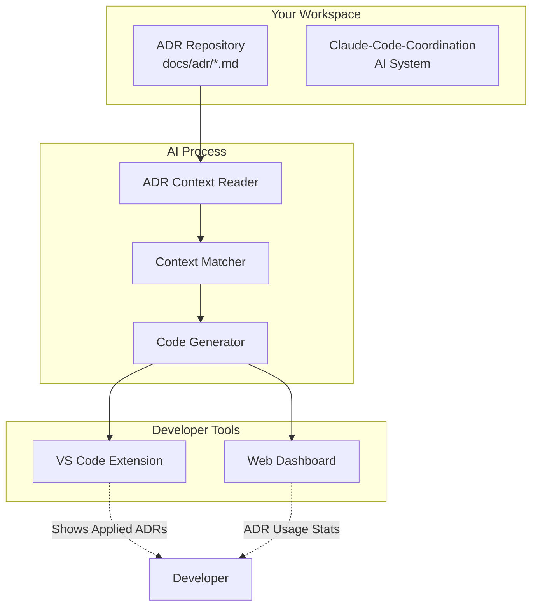
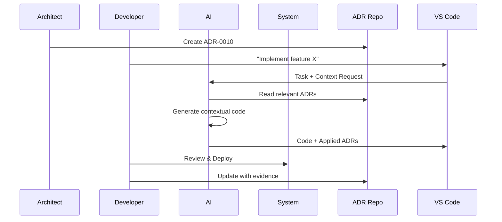

# 🧠 ADR-Integration Guide: AI that Reads Your Architecture

Complete guide to setting up **world-first** ADR-aware AI code generation.

## 📋 Overview

This integration allows Claude-Code-Coordination to automatically read and follow Architecture Decision Records (ADRs) when generating code, ensuring consistency with your team's architectural decisions.

## 🏗️ Architecture



## 🚀 Quick Setup

### Prerequisites
- Node.js 18+ 
- VS Code (recommended)
- Git repository with ADRs

### 1. Install Claude-Code-Coordination

```bash
# Clone the AI system
git clone https://github.com/mandymgr/claude-code-coordination.git
cd claude-code-coordination

# Install dependencies
pnpm install

# Build the system
pnpm run build
```

### 2. Setup ADR Repository Structure

Your ADR repository should follow this structure:

```
your-adr-repo/
├── docs/
│   └── adr/
│       ├── ADR-0001-use-postgresql-for-data.md
│       ├── ADR-0002-implement-oauth2-auth.md
│       └── ADR-0003-choose-react-for-frontend.md
└── README.md
```

### 3. Position Repositories

Place both repositories in the same parent directory:

```bash
your-workspace/
├── claude-code-coordination/    # The AI system
└── your-adr-repo/              # Your ADR repository
    └── docs/adr/               # ADR files here
```

### 4. Test Integration

```bash
cd claude-code-coordination/packages/ai-core
node src/test-adr-integration.js
```

Expected output:
```
🧠 ADR-Aware AI Integration Demo
==================================================
📋 Found 3 ADR files:
  • ADR-0001: Use PostgreSQL for data storage
  • ADR-0002: Implement OAuth2 authentication  
  • ADR-0003: Choose React for frontend

🎯 Relevant ADRs found for "create database schema"
💭 AI would generate PostgreSQL schema following ADR-0001
```

## 📝 ADR Format Requirements

### Supported Formats

The system works with standard Markdown ADR formats:

```markdown
# ADR-0001: Use PostgreSQL for data storage
**Dato:** 2025-01-17  •  **Komponent:** database  •  **Eier:** @techteam

## Problem
Need reliable data storage with ACID properties...

## Alternativer  
1) PostgreSQL - Strong consistency, mature ecosystem
2) MongoDB - Document flexibility, eventual consistency
3) SQLite - Lightweight, file-based

## Beslutning
Chosen: PostgreSQL. Reasoning: ACID compliance required for financial data...

## Evidens (før/etter)
Before: No centralized data storage
After: 99.9% uptime, <100ms query response
```

### Key Elements Extracted

- **Number**: `ADR-0001`  
- **Title**: `Use PostgreSQL for data storage`
- **Component**: `database`
- **Decision**: Content under `## Beslutning`
- **Alternatives**: Content under `## Alternativer`
- **Evidence**: Content under `## Evidens`

## 🛠️ VS Code Integration

### Install Extension

```bash
cd apps/extension
npm run package
code --install-extension claude-code-coordination-3.0.0.vsix
```

### Using ADR-Aware Commands

1. **Open VS Code** in a project directory
2. **Run Command**: `Ctrl+Shift+P` → "Claude Code: Assign Task"
3. **Enter Task**: e.g., "Create user authentication system"
4. **AI Process**:
   - 🔍 Automatically searches for ADRs
   - 📋 Finds ADR-0002 about OAuth2 authentication
   - 💻 Generates OAuth2-compliant code
   - 📊 Shows applied ADRs in output panel

### ADR Context Display

The extension shows which ADRs are being applied:

```
📋 Applied ADRs for task: "Create authentication"
──────────────────────────────────────────────────
• ADR-0002: Implement OAuth2 authentication
  Component: auth/backend
  Decision: Use OAuth2 with PKCE for security...

💡 Recommendations:
• Consider ADR-0002: Implement OAuth2 authentication
• Review related resources from ADR-0002
```

## 🎯 Context Matching Algorithm

### How AI Finds Relevant ADRs

1. **Keyword Extraction**: Extract technical terms from task
   ```typescript
   "Create search functionality" → ["search", "database", "api"]
   ```

2. **Component Inference**: Determine likely component
   ```typescript
   "search functionality" → "platform/search"
   ```

3. **ADR Matching**: Find ADRs with matching:
   - Component names
   - Keywords in title/decision
   - Technical terms

4. **Relevance Scoring**: Rank by relevance to current task

### Example Matching

```typescript
Task: "Implement user search with semantic capabilities"

Extracted Keywords: ["search", "semantic", "user"]
Inferred Component: "platform/search"

Matched ADRs:
✅ ADR-0001: pgvector for semantic search (component: platform/search)
✅ ADR-0005: User data indexing strategy (component: platform/user)
❌ ADR-0003: Frontend styling guide (component: frontend/ui)
```

## 🔧 Advanced Configuration

### Custom ADR Paths

Configure custom ADR locations:

```typescript
// In your workspace settings
{
  "claude-code.adrPaths": [
    "./docs/decisions",
    "../company-standards/adr",
    "./architecture/decisions"
  ]
}
```

### Component Mapping

Define custom component mappings:

```typescript
// packages/ai-core/src/context-aware-ai.ts
const componentMappings = {
  "authentication": "platform/auth",
  "search": "platform/search", 
  "frontend": "web/ui",
  "api": "backend/api"
};
```

### ADR Template Customization

Support for custom ADR templates:

```markdown
<!-- Custom template example -->
# Decision: {{TITLE}}
**Date:** {{DATE}} | **Owner:** {{OWNER}} | **Status:** {{STATUS}}

## Context and Problem
{{CONTEXT}}

## Considered Options  
{{OPTIONS}}

## Decision Outcome
{{DECISION}}

## Consequences
{{CONSEQUENCES}}
```

## 📊 Monitoring and Analytics

### ADR Usage Tracking

The system tracks which ADRs are being used:

```typescript
// Automatically logged
{
  timestamp: "2025-01-17T10:30:00Z",
  task: "Create search API endpoint", 
  appliedADRs: ["ADR-0001", "ADR-0007"],
  component: "backend/api",
  codeGenerated: true,
  tokensUsed: 1250
}
```

### Dashboard Metrics

View ADR integration metrics in the web dashboard:

- 📊 **Most Used ADRs** 
- 🎯 **Component Coverage**
- ⚡ **Response Time Impact**
- 📈 **Compliance Rate**

## 🚨 Troubleshooting

### Common Issues

**1. ADRs Not Found**
```
❌ No ADR context found
```
**Solution**: Check repository structure and paths:
```bash
# Verify ADR files exist
ls docs/adr/ADR-*.md

# Check file permissions
ls -la docs/adr/
```

**2. Parsing Errors**
```
❌ Could not parse ADR: invalid format
```
**Solution**: Verify ADR format matches requirements:
```markdown
# Must start with: # ADR-XXXX: Title
# Must have sections: ## Beslutning, ## Problem
```

**3. No Relevant ADRs Matched**
```
⚠️ No relevant ADRs found for task
```
**Solution**: 
- Use more specific task descriptions
- Add relevant keywords from your ADRs
- Consider creating new ADR for this architectural decision

### Debug Mode

Enable debug logging:

```bash
export DEBUG=claude-code:adr
node src/test-adr-integration.js
```

## 🎯 Best Practices

### Writing AI-Friendly ADRs

**✅ Good ADR Titles:**
- "Use PostgreSQL for user data storage"
- "Implement OAuth2 with PKCE for authentication"  
- "Choose React with TypeScript for frontend"

**❌ Avoid Vague Titles:**
- "Database decision"
- "Authentication stuff"
- "Frontend changes"

### Component Naming

Use consistent component naming across ADRs:

```
platform/auth     - Authentication & authorization
platform/search   - Search functionality  
platform/data     - Data storage & processing
frontend/ui       - User interface components
backend/api       - API endpoints & services
```

### Decision Documentation

Include implementation details in decisions:

```markdown
## Beslutning
Chosen: PostgreSQL with pgvector extension.

Implementation details:
- Use vector(1536) for OpenAI embeddings
- Create indexes with ivfflat for cosine similarity
- Connection pooling with pg-pool (max 20 connections)

Rollback plan: Migrate to Elasticsearch if query performance < 100ms p95.
```

## 🔄 Integration Workflow

### Development Lifecycle

1. **Architecture Discussion** → Create ADR with `adr_new.sh`
2. **ADR Review** → Team reviews and approves decision
3. **Implementation** → Developer uses "Assign Task" in VS Code
4. **AI Generation** → Code generated following ADR guidelines  
5. **Quality Review** → Code automatically follows architecture
6. **Deployment** → Update ADR with evidence/metrics

### Team Workflow



## 📚 Resources

### Documentation
- [ADR-0004: AI Integration Decision](../Krins-Dev-Memory-OS/docs/adr/ADR-0004-ai-kontekst-integrasjon-med-claude-code-coordination.md)
- [Claude-Code-Coordination README](../README.md#adr-aware-architecture-intelligence)

### Code Examples  
- [ADR Context Reader](../packages/ai-core/src/adr-context-reader.ts)
- [Context-Aware AI](../packages/ai-core/src/context-aware-ai.ts)
- [Integration Demo](../packages/ai-core/src/test-adr-integration.js)

### External Tools
- [adr-tools](https://github.com/npryce/adr-tools) - Standard ADR tooling
- [Krins-Dev-Memory-OS](https://github.com/mandymgr/krins-dev-memory-os) - ADR template system

---

🎯 **Result:** AI that understands and follows your architectural decisions automatically!