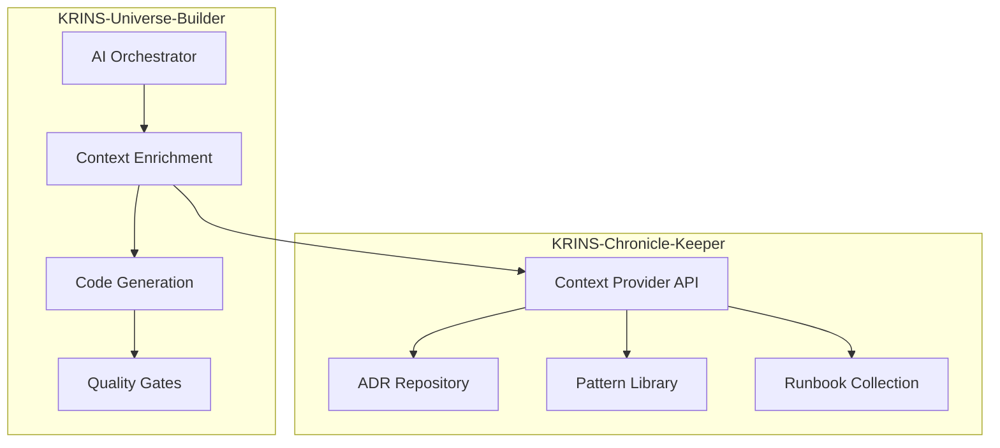

# 🔗 KRINS-Chronicle-Keeper Integration

**AI-Powered Organizational Intelligence Integration**  
**KRINS-Universe-Builder ↔ KRINS-Chronicle-Keeper**

---

## 🎯 **Integration Overview**

KRINS-Universe-Builder integrates with KRINS-Chronicle-Keeper to access organizational intelligence (ADRs, patterns, runbooks) for intelligent, decision-aware code generation.

### **Integration Benefits**
- 🧠 **Institutional Memory** - AI has access to team decisions and patterns
- ⚖️ **Automatic Compliance** - Generated code follows architectural decisions
- 📈 **Continuous Learning** - System learns from organizational wisdom
- 🤝 **Team Alignment** - Consistent architecture across all generated code

---

## 🏗️ **Architecture Overview**



### **Integration Flow**
1. **Request Initiation** - User requests code generation in Universe-Builder
2. **Context Enrichment** - System requests organizational context from Chronicle-Keeper
3. **ADR Parsing** - Chronicle-Keeper parses relevant architectural decisions
4. **Pattern Matching** - Relevant code patterns and constraints identified
5. **Context Injection** - Organizational wisdom injected into AI prompts
6. **Intelligent Generation** - AI generates code following team decisions
7. **Compliance Validation** - Generated code validated against architectural constraints

---

## 🔧 **Technical Implementation**

### **Context Provider Service**
```typescript
// Universe-Builder integration point
export class ChronicleKeeperIntegration {
  private contextProvider: ContextProvider;
  
  constructor(chronicleKeeperPath: string) {
    this.contextProvider = new ContextProvider(chronicleKeeperPath);
  }
  
  async enrichCodeGeneration(
    request: CodeGenerationRequest
  ): Promise<EnrichedCodeGenerationRequest> {
    // Get relevant organizational context
    const context = await this.getRelevantContext(request);
    
    // Enrich the request with organizational wisdom
    return {
      ...request,
      organizationalContext: context,
      architecturalConstraints: context.constraints,
      codePatterns: context.patterns.filter(p => 
        p.language === request.targetLanguage
      ),
      relatedDecisions: context.decisions.filter(d => 
        this.isRelevantToRequest(d, request)
      )
    };
  }
  
  private async getRelevantContext(
    request: CodeGenerationRequest
  ): Promise<OrganizationalContext> {
    if (request.technology) {
      return this.contextProvider.getContextForTechnology(request.technology);
    }
    
    return this.contextProvider.getContextForAI();
  }
}
```

### **AI Prompt Enhancement**
```typescript
export class AIPromptEnhancer {
  static enhanceWithOrganizationalContext(
    basePrompt: string,
    context: OrganizationalContext
  ): string {
    const contextSummary = this.generateContextSummary(context);
    
    return `
${basePrompt}

## Organizational Context
You must follow these architectural decisions and patterns:

${contextSummary}

## Constraints
${context.constraints.map(c => `- ${c.description}`).join('\n')}

## Required Patterns
${context.patterns.map(p => `- ${p.language}/${p.category}: ${p.description}`).join('\n')}

Generate code that strictly adheres to these organizational standards.
`;
  }
}
```

---

## 📋 **Integration Configuration**

### **Environment Setup**
```bash
# Set up workspace with both systems
mkdir krins-workspace
cd krins-workspace

# Clone both repositories
git clone <universe-builder-repo> KRINS-Universe-Builder
git clone <chronicle-keeper-repo> KRINS-Chronicle-Keeper

# Environment variables
export KRINS_WORKSPACE=$(pwd)
export CHRONICLE_KEEPER_PATH="$KRINS_WORKSPACE/KRINS-Chronicle-Keeper"
export UNIVERSE_BUILDER_PATH="$KRINS_WORKSPACE/KRINS-Universe-Builder"
```

### **Configuration File**
```yaml
# krins-integration-config.yml
integration:
  chronicleKeeper:
    path: "../KRINS-Chronicle-Keeper"
    autoDiscovery: true
    contextCaching: true
    cacheTimeout: 300 # 5 minutes
    
  contextProvider:
    includeDeprecatedADRs: false
    maxContextSize: 10000 # characters
    filterByRelevance: true
    relevanceThreshold: 0.7
    
  aiEnhancement:
    enableContextInjection: true
    prioritizeRecentDecisions: true
    includeImplementationNotes: true
```

---

## 🔄 **Real-time Integration**

### **Context Synchronization**
```typescript
export class RealtimeContextSync {
  private wsConnection: WebSocket;
  private contextCache: Map<string, OrganizationalContext>;
  
  async initializeSync(): Promise<void> {
    // Set up file watchers for ADR changes
    this.watchADRChanges();
    
    // Set up WebSocket for real-time updates
    this.wsConnection = new WebSocket('ws://localhost:3001/context-sync');
    
    this.wsConnection.onmessage = (event) => {
      const update = JSON.parse(event.data);
      this.handleContextUpdate(update);
    };
  }
  
  private watchADRChanges(): void {
    const adrPath = path.join(process.env.CHRONICLE_KEEPER_PATH!, 'docs/adr');
    
    fs.watch(adrPath, { recursive: true }, (eventType, filename) => {
      if (filename?.endsWith('.md')) {
        this.invalidateContextCache();
        this.notifyContextChange(filename);
      }
    });
  }
  
  private async handleContextUpdate(update: ContextUpdate): Promise<void> {
    // Invalidate relevant cache entries
    this.contextCache.clear();
    
    // Broadcast update to active code generation sessions
    await this.broadcastContextUpdate(update);
  }
}
```

### **Live Context Updates**
```typescript
export class LiveContextProvider extends ContextProvider {
  private eventEmitter = new EventEmitter();
  
  onContextChange(callback: (context: OrganizationalContext) => void): void {
    this.eventEmitter.on('contextChanged', callback);
  }
  
  async getContextForAI(): Promise<OrganizationalContext> {
    const context = await super.getContextForAI();
    
    // Emit context change event
    this.eventEmitter.emit('contextChanged', context);
    
    return context;
  }
}
```

---

## 📊 **Integration Analytics**

### **Usage Metrics**
```typescript
export interface IntegrationMetrics {
  contextRequests: number;
  averageResponseTime: number;
  cacheHitRate: number;
  mostUsedADRs: Array<{ id: string; usage: number }>;
  technologyBreakdown: Record<string, number>;
  generationSuccess: number;
  complianceScore: number;
}

export class IntegrationAnalytics {
  async generateMetrics(): Promise<IntegrationMetrics> {
    return {
      contextRequests: await this.getContextRequestCount(),
      averageResponseTime: await this.getAverageResponseTime(),
      cacheHitRate: await this.getCacheHitRate(),
      mostUsedADRs: await this.getMostUsedADRs(),
      technologyBreakdown: await this.getTechnologyBreakdown(),
      generationSuccess: await this.getGenerationSuccessRate(),
      complianceScore: await this.getComplianceScore()
    };
  }
}
```

### **Quality Metrics**
```typescript
export class QualityMetrics {
  async measureComplianceScore(
    generatedCode: string,
    appliedContext: OrganizationalContext
  ): Promise<number> {
    let score = 100;
    
    // Check compliance with architectural constraints
    for (const constraint of appliedContext.constraints) {
      if (!this.validateConstraint(generatedCode, constraint)) {
        score -= 10;
      }
    }
    
    // Check pattern adherence
    for (const pattern of appliedContext.patterns) {
      if (!this.validatePattern(generatedCode, pattern)) {
        score -= 5;
      }
    }
    
    return Math.max(0, score);
  }
}
```

---

## 🎯 **Integration Examples**

### **Example 1: Database Service Generation**

**Chronicle-Keeper Context:**
```markdown
# ADR-0002: Use pgvector for semantic search
## Decision
Use PostgreSQL with pgvector extension for all semantic search functionality.

## Constraints
- All database connections must use connection pooling
- Queries must include proper error handling
- Vector operations require proper indexing
```

**Enhanced Code Generation:**
```typescript
// Universe-Builder generates this with Chronicle-Keeper context
export class SemanticSearchService {
  private pool: Pool; // Following ADR-0002: connection pooling required
  
  constructor() {
    // Following ADR-0002: PostgreSQL with pgvector
    this.pool = new Pool({
      connectionString: process.env.DATABASE_URL,
      max: 20, // Connection pooling as per constraints
    });
  }
  
  async searchDocuments(query: string): Promise<SearchResult[]> {
    try {
      // Following ADR-0002: pgvector for semantic search
      const embedding = await this.generateEmbedding(query);
      
      const result = await this.pool.query(`
        SELECT 
          id, 
          content, 
          1 - (embedding <=> $1) as similarity
        FROM documents 
        ORDER BY embedding <=> $1 
        LIMIT 10
      `, [embedding]);
      
      return result.rows;
    } catch (error) {
      // Proper error handling as per constraints
      throw new DatabaseError('Search failed', error);
    }
  }
}
```

### **Example 2: Authentication Integration**

**Chronicle-Keeper Pattern:**
```typescript
// docs/patterns/typescript/auth-pattern.ts
export interface AuthenticationPattern {
  // JWT-based authentication with role-based access control
  validateToken(token: string): Promise<UserContext>;
  checkPermission(user: UserContext, resource: string): boolean;
}
```

**Generated Implementation:**
```typescript
// AI automatically follows the established authentication pattern
export class AuthService implements AuthenticationPattern {
  async validateToken(token: string): Promise<UserContext> {
    // Implementation follows established pattern
    const decoded = jwt.verify(token, process.env.JWT_SECRET!);
    return this.createUserContext(decoded);
  }
  
  checkPermission(user: UserContext, resource: string): boolean {
    // Role-based access control as per pattern
    return user.permissions.includes(resource);
  }
}
```

---

## 🔒 **Security & Compliance**

### **Secure Context Transfer**
```typescript
export class SecureContextTransfer {
  async getSecureContext(
    request: CodeGenerationRequest
  ): Promise<SanitizedContext> {
    const fullContext = await this.contextProvider.getContextForAI();
    
    // Remove sensitive information
    return {
      decisions: fullContext.decisions.map(d => ({
        ...d,
        decision: this.sanitizeContent(d.decision),
        rationale: this.sanitizeContent(d.rationale)
      })),
      patterns: fullContext.patterns.filter(p => !p.internal),
      constraints: fullContext.constraints.filter(c => c.public)
    };
  }
  
  private sanitizeContent(content: string): string {
    // Remove API keys, passwords, internal URLs, etc.
    return content
      .replace(/api[_-]?key[:\s=]+[^\s]+/gi, 'API_KEY_REDACTED')
      .replace(/password[:\s=]+[^\s]+/gi, 'PASSWORD_REDACTED')
      .replace(/https?:\/\/internal\.[^\s]+/gi, 'INTERNAL_URL_REDACTED');
  }
}
```

### **Audit Trail**
```typescript
export class IntegrationAuditTrail {
  async logContextUsage(usage: ContextUsageEvent): Promise<void> {
    const auditEntry = {
      timestamp: new Date(),
      requestId: usage.requestId,
      userId: usage.userId,
      contextType: usage.contextType,
      adrIds: usage.appliedADRs,
      generatedCodeHash: this.hashCode(usage.generatedCode),
      complianceScore: usage.complianceScore
    };
    
    await this.auditLogger.log(auditEntry);
  }
}
```

---

## 🚀 **Performance Optimization**

### **Context Caching Strategy**
```typescript
export class PerformantContextProvider {
  private cache = new LRUCache<string, OrganizationalContext>({
    max: 100,
    ttl: 300000 // 5 minutes
  });
  
  async getOptimizedContext(
    request: CodeGenerationRequest
  ): Promise<OrganizationalContext> {
    const cacheKey = this.generateCacheKey(request);
    
    if (this.cache.has(cacheKey)) {
      return this.cache.get(cacheKey)!;
    }
    
    const context = await this.fetchFreshContext(request);
    this.cache.set(cacheKey, context);
    
    return context;
  }
}
```

### **Incremental Updates**
```typescript
export class IncrementalContextUpdater {
  private lastUpdate: Date = new Date(0);
  private contextDelta: Partial<OrganizationalContext> = {};
  
  async getIncrementalUpdate(): Promise<Partial<OrganizationalContext>> {
    const changes = await this.detectChanges(this.lastUpdate);
    this.lastUpdate = new Date();
    
    return changes;
  }
  
  private async detectChanges(
    since: Date
  ): Promise<Partial<OrganizationalContext>> {
    // Only process files modified since last update
    const changedADRs = await this.getChangedADRs(since);
    const changedPatterns = await this.getChangedPatterns(since);
    
    return {
      decisions: changedADRs,
      patterns: changedPatterns
    };
  }
}
```

---

## 📈 **Success Metrics**

### **Integration KPIs**
- **Context Accuracy:** 95%+ relevant context provided
- **Response Time:** <500ms for context retrieval
- **Compliance Score:** 90%+ generated code follows ADRs
- **Cache Hit Rate:** 80%+ cache effectiveness
- **Developer Satisfaction:** 4.5/5.0 integration experience

### **Business Impact**
- **Architecture Consistency:** 85% reduction in architecture drift
- **Onboarding Time:** 60% faster new developer onboarding
- **Code Quality:** 40% improvement in architectural compliance
- **Technical Debt:** 50% reduction in inconsistent implementations

---

## 🔧 **Troubleshooting**

### **Common Issues**

#### **Context Not Loading**
```typescript
// Debug context provider
const debugProvider = new ContextProvider(chronicleKeeperPath);
debugProvider.setLogLevel('debug');

const context = await debugProvider.getContextForAI();
console.log('Context loaded:', context.decisions.length, 'decisions');
```

#### **Integration Path Issues**
```bash
# Verify paths
echo $CHRONICLE_KEEPER_PATH
ls -la $CHRONICLE_KEEPER_PATH/docs/adr/

# Check permissions
chmod -R +r $CHRONICLE_KEEPER_PATH/docs/
```

#### **Performance Issues**
```typescript
// Enable caching
const cachedProvider = new PerformantContextProvider(chronicleKeeperPath);
cachedProvider.enableCaching(true);
```

---

**Status:** Production-ready cross-system integration ⭐⭐⭐⭐⭐

*This integration transforms both systems into the world's first AI platform with institutional memory!* 🌌🧠