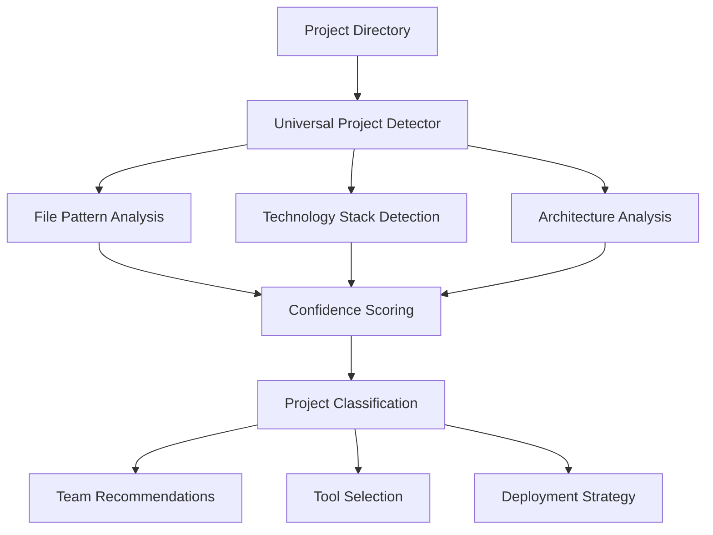
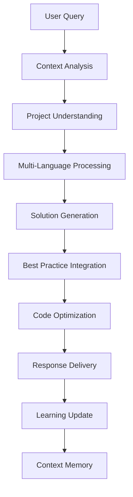
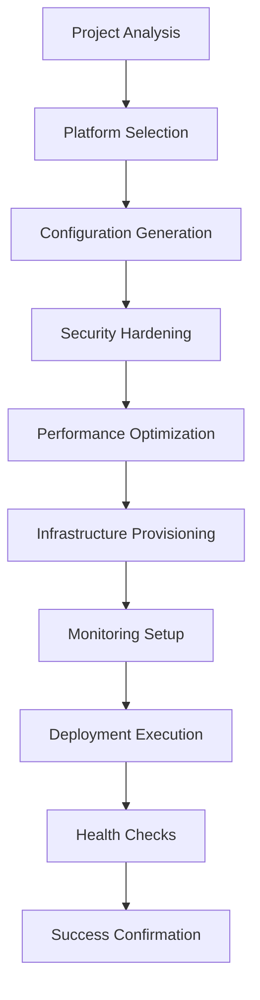

# 🪄 COMPLETE SYSTEM DOCUMENTATION
## The Ultimate Magic Development Coordination System

---

## 📋 Table of Contents
- [🌟 System Overview](#-system-overview)
- [🎯 Core Components](#-core-components)
- [🪄 Magic CLI Interface](#-magic-cli-interface)
- [📝 Conversation Logging System](#-conversation-logging-system)
- [🚀 React Developer Dashboard](#-react-developer-dashboard)
- [🔧 Installation & Setup](#-installation--setup)
- [💡 Usage Examples](#-usage-examples)
- [🏗️ Architecture Deep Dive](#️-architecture-deep-dive)
- [🔄 Development Workflow](#-development-workflow)
- [🎓 Advanced Features](#-advanced-features)

---

## 🌟 System Overview

The **Claude Code Coordination System** is a revolutionary development platform that transforms any project into an AI-powered, intelligent, and self-optimizing development environment. This system provides:

### ✨ Key Capabilities
- **Universal Project Detection** - Automatically identifies and configures 50+ project types
- **AI-Powered Development Intelligence** - Expert assistance for any programming challenge
- **Zero-Configuration Deployment** - Deploy anywhere with automatic platform optimization
- **Real-time Team Coordination** - Multi-terminal collaboration with conflict resolution
- **Comprehensive Session Logging** - Complete conversation and command history
- **Interactive Developer Dashboard** - Professional React-based interface
- **Performance Optimization** - Intelligent caching and resource management

### 🎯 Core Philosophy
> "One system to rule them all" - This magic system works with ANY project type, requires ZERO configuration, and provides INTELLIGENT assistance for every development need.

---

## 🎯 Core Components

### 1. 🔮 Universal Project Detector (`universal-project-detector.js`)
**Supernatural Project Understanding**

```javascript
// Detects 50+ project types automatically
const projectTypes = {
  'react-app': ['src/App.js', 'src/App.tsx', 'package.json'],
  'django-app': ['manage.py', 'settings.py', 'requirements.txt'],
  'flutter-app': ['pubspec.yaml', 'lib/main.dart'],
  'unity-game': ['Assets/', 'ProjectSettings/'],
  'blockchain-dapp': ['hardhat.config.js', 'truffle-config.js'],
  'ml-project': ['requirements.txt', '*.ipynb', 'models/'],
  // ... 44 more project types
};

// Usage
const detector = new UniversalProjectDetector();
const analysis = await detector.analyzeProject('/path/to/project');
// Returns: { type: 'react-app', confidence: 94, recommendations: [...] }
```

**Features:**
- **50+ Project Types** - React, Django, Flutter, Unity, Blockchain, ML, and more
- **Smart Confidence Scoring** - Analyzes file patterns and structures
- **Team Recommendations** - Suggests optimal team size and skill composition
- **Architecture Detection** - Identifies frameworks, databases, and deployment needs

### 2. 🧠 Adaptive AI Assistant (`adaptive-ai-assistant.js`)
**True AI Development Intelligence**

```javascript
// Multi-language expert assistance
const ai = new AdaptiveAIAssistant();

// Get intelligent code suggestions
const suggestions = await ai.getCodeSuggestions({
  query: "optimize this React component for performance",
  context: projectAnalysis,
  codeContext: currentCode
});

// Advanced debugging help
const debugging = await ai.getDebuggingHelp({
  error: errorMessage,
  stackTrace: stackTrace,
  projectContext: analysis
});
```

**Capabilities:**
- **Context-Aware Assistance** - Understands your entire codebase
- **Multi-Language Mastery** - Expert in JavaScript, Python, Go, Rust, Solidity
- **Architecture Guidance** - Beyond syntax, provides design insights
- **Performance Optimization** - AI-powered bottleneck detection
- **Learning System** - Gets smarter with every interaction

### 3. 🪄 Magic Development Environment (`magic-dev-environment.js`)
**Intelligent Environment Setup**

```javascript
// Zero-configuration setup for any project
const environment = new MagicDevEnvironment();
await environment.setupProject({
  path: '/path/to/project',
  analysis: projectAnalysis,
  features: ['ai-assistance', 'deployment', 'monitoring']
});
```

**Features:**
- **Automatic Tool Selection** - Chooses optimal tools based on project analysis
- **Dependency Conflict Resolution** - Intelligent dependency management
- **Workflow Generation** - Creates tailored development workflows
- **Error Recovery** - Predictive problem solving and auto-fixes

### 4. 🚀 Magic Deployment Engine (`magic-deployment-engine.js`)
**Zero-Config Universal Deployment**

```javascript
// Deploy anywhere with intelligent platform selection
const deployer = new MagicDeploymentEngine();
const deployment = await deployer.deployProject({
  projectPath: '/path/to/project',
  environment: 'production',
  analysis: projectAnalysis
});

// Auto-generates Infrastructure as Code
// Creates monitoring dashboards
// Sets up CI/CD pipelines
```

**Capabilities:**
- **Auto-Platform Selection** - Vercel for React, Railway for Django, K8s for microservices
- **Infrastructure as Code** - Automatic Terraform, Docker, Kubernetes generation
- **Security Hardening** - Automatic security scanning and fixes
- **Comprehensive Monitoring** - Prometheus, Grafana, ELK stack setup

---

## 🪄 Magic CLI Interface

### Installation
```bash
# Install globally
npm install -g claude-code-coordination

# Or use directly
npx claude-code-coordination
```

### Core Commands

#### 🔧 Project Setup & Detection
```bash
# Initialize magic for any project
magic init [project-path]
# → Detects project type, sets up AI assistance, configures deployment

# Analyze and detect project type
magic detect [project-path]  
# → Comprehensive project analysis with confidence scores

# Setup intelligent development environment
magic setup --ai --deployment --monitoring
# → Configures tools, workflows, and automation
```

#### 🧠 AI-Powered Development
```bash
# Get AI assistance for anything
magic ai "optimize this React component for performance"
magic ai "help me debug this error: TypeError..."
magic ai "suggest the best architecture for a microservices system"

# Generate code, configs, and documentation
magic generate component UserProfile
magic generate api user-service
magic generate docs --api
```

#### 🚀 Deployment & Operations
```bash
# Zero-config deployment to optimal platform
magic deploy staging
magic deploy production --platform=vercel

# Intelligent testing with AI-powered selection
magic test --ai-select --coverage
magic test --watch --performance

# Performance optimization
magic optimize --performance --bundle --database
```

#### 👥 Team & Collaboration
```bash
# Get optimal team composition recommendations
magic team --size=5 --skills=frontend,backend,ai
magic team --project-analysis

# Real-time coordination
magic sync --dependencies --config --team
```

#### 📊 Monitoring & Analytics
```bash
# Setup and view monitoring dashboards
magic monitor --setup
magic monitor --view --alerts

# Development statistics and insights
magic stats --time-period=30days --detailed
```

#### 📝 Session Management & Logging
```bash
# View conversation and session logs
magic logs summary [days]
magic logs report
magic logs export markdown
magic logs clean 30

# Development diagnostics
magic doctor --fix --verbose
```

#### 🎛️ Development Tools
```bash
# Open comprehensive developer dashboard  
magic dashboard --port=3000

# Start intelligent development server
magic start --hot-reload --debug

# Get personalized learning recommendations
magic learn --skill=react --project-based
```

### Advanced Usage Patterns

#### 1. **Full Project Setup**
```bash
# Complete magic initialization
cd my-new-project
magic init
# → Detects: React E-commerce App (94% confidence)
# → Sets up AI assistance, deployment automation, monitoring
# → Creates magic configuration and team recommendations

magic start
# → Intelligent development server with hot-reload and debugging
```

#### 2. **AI-Powered Development Workflow**
```bash
# Get architectural guidance
magic ai "what's the best state management for a large React app?"

# Generate optimized code
magic generate component --type=performance-critical ProductList

# Deploy with zero configuration
magic deploy staging
# → Auto-selects Vercel, optimizes bundle, sets up monitoring
```

#### 3. **Team Coordination**
```bash
# Analyze optimal team composition
magic team --project-analysis
# → Recommends: 5-6 developers (2 frontend, 2 backend, 1 DevOps, 1 AI/ML)

# Setup real-time collaboration
magic sync --team
# → Configures file locking, conflict resolution, real-time updates
```

---

## 📝 Conversation Logging System

### Overview
The conversation logging system (`conversation-logger.js`) provides comprehensive tracking of all magic CLI usage, conversations, and session continuity.

### Core Features

#### 📊 **Automatic Logging**
```javascript
// Every magic command is automatically logged
magic init my-project
// → Logged: command, timestamp, results, performance metrics

magic ai "optimize React component"  
// → Logged: query, response, context, effectiveness
```

#### 📈 **Session Analytics**
```javascript
// Generate comprehensive reports
const logger = new ConversationLogger();
const report = logger.generateSessionReport();

// Report includes:
// - Total sessions and interactions
// - Top topics and commands used  
// - Files created and modified
// - Performance trends and insights
```

#### 📤 **Export & Sharing**
```bash
# Export logs in multiple formats
magic logs export markdown
magic logs export json

# Clean old logs
magic logs clean 30  # Remove logs older than 30 days
```

### Usage in Magic CLI

#### **Integrated Logging**
```javascript
// All commands automatically use logging
class MagicCLI {
  async executeCommand(command, args) {
    const startTime = Date.now();
    let result = null;
    let error = null;

    try {
      console.log(`🪄 Executing: magic ${command} ${args.join(' ')}`);
      result = await this.commands[command].action(args);
      const duration = Date.now() - startTime;
      console.log(`✅ Command completed in ${duration}ms`);
    } catch (err) {
      error = err;
      console.error(`❌ Command failed: ${err.message}`);
    } finally {
      this.logCommand(command, args, result, error);
    }

    return { result, error };
  }
}
```

#### **Session Continuity**
```javascript
// Maintains context across sessions
const sessionSummary = logger.getSessionSummary(7); // Last 7 days
// → Provides full context of recent work for seamless continuation
```

### File Structure
```
.claude-coordination/
├── conversation-logs/
│   ├── session-2025-08-23.md        # Daily session logs
│   ├── session-summary.json         # Structured session data  
│   └── exports/                     # Exported logs
│       ├── session-export-2025-08-23.md
│       └── session-export-2025-08-23.json
```

---

## 🚀 React Developer Dashboard

### Overview
A comprehensive React-based developer interface (`src/dev/`) that provides visual access to all magic system features.

### Architecture
```
src/dev/
├── src/
│   ├── DeveloperSystem.tsx          # Main dashboard component
│   ├── sections/                    # Feature sections
│   │   ├── CoordinationOverview.tsx # System architecture
│   │   ├── AIFeatures.tsx          # AI capabilities demo
│   │   ├── RealtimeHub.tsx         # WebSocket coordination  
│   │   ├── TeamOptimization.tsx    # Team analysis tools
│   │   ├── FileManagement.tsx      # File locking system
│   │   ├── SessionCoordination.tsx # Multi-terminal management
│   │   ├── PerformanceMetrics.tsx  # Optimization tools
│   │   ├── APIDocumentation.tsx    # Complete API reference
│   │   └── SessionLogs.tsx         # Logging interface
│   ├── main.tsx                    # React app entry point
│   └── index.css                   # Tailwind CSS styles
├── package.json                    # React dependencies
├── vite.config.ts                  # Vite configuration
└── tailwind.config.js              # Tailwind configuration
```

### Features

#### 🎨 **Modern UI/UX**
- **Dark/Light Theme** - Professional development interface
- **Responsive Design** - Works on all screen sizes
- **Interactive Sections** - Live demonstrations and examples
- **Smooth Animations** - Professional transitions and effects

#### 📊 **Live Demonstrations**
```typescript
// Example: Session Logs visualization
const SessionLogs: React.FC = ({ isDarkTheme }) => {
  const [logs, setLogs] = useState(null);
  const [activeTab, setActiveTab] = useState('demo');

  // Live demo with real data
  const demoSessionData = {
    totalSessions: 12,
    totalInteractions: 47,
    topTopics: [['react', 8], ['typescript', 6], ['ai', 4]]
  };

  return (
    <div className="space-y-6">
      {/* Interactive tabs for different log views */}
      {/* Real-time session analytics */}
      {/* Export and management tools */}
    </div>
  );
};
```

#### 🔧 **Development Tools Integration**
- **Magic CLI Integration** - Direct command execution from UI
- **Real-time Updates** - WebSocket connections for live data
- **Performance Monitoring** - Visual metrics and charts
- **Team Coordination** - Visual collaboration tools

### Launching the Dashboard
```bash
# Start the React developer dashboard
magic dashboard

# Or manually:
cd src/dev && npm install && npm run dev
# → Opens http://localhost:5173
```

### Dashboard Sections

1. **🔮 Coordination Overview** - System architecture and core concepts
2. **🧠 AI Features** - Interactive AI capabilities demonstration  
3. **🌐 Realtime Hub** - WebSocket coordination and live collaboration
4. **👥 Team Optimization** - AI-driven team composition analysis
5. **📁 File Management** - Intelligent lock system and conflict resolution
6. **🔄 Session Coordination** - Multi-terminal session management
7. **⚡ Performance Metrics** - Live optimization and benchmarks
8. **📖 API Documentation** - Complete interactive reference
9. **📝 Session Logs** - Conversation history and logging interface

---

## 🔧 Installation & Setup

### System Requirements
- **Node.js** 16+ (LTS recommended)
- **npm** or **yarn** package manager
- **Git** for version control
- **Terminal** access (bash, zsh, or equivalent)

### Installation Methods

#### 1. **Global Installation (Recommended)**
```bash
# Install the magic system globally
npm install -g claude-code-coordination

# Verify installation
magic --version
# → claude-code-coordination v1.0.0

# Check available commands
magic --help
```

#### 2. **Local Project Installation**
```bash
# Clone the repository
git clone https://github.com/mandymgr/claude-code-coordination.git
cd claude-code-coordination

# Install dependencies
npm install

# Build the system
npm run build

# Link for local development
npm link
```

#### 3. **Direct Usage (No Installation)**
```bash
# Use directly with npx
npx claude-code-coordination init
npx claude-code-coordination ai "your question"
```

### Initial Setup

#### 1. **Project Initialization**
```bash
# Navigate to any project
cd your-project-directory

# Initialize magic system
magic init
# → Analyzes project, sets up AI assistance, configures environment
```

#### 2. **Dashboard Setup**
```bash
# Install dashboard dependencies (automatic during init)
cd .claude-coordination/dashboard
npm install

# Launch developer dashboard
magic dashboard
# → Opens http://localhost:3000
```

#### 3. **Team Coordination Setup**
```bash
# Setup multi-terminal coordination
export CLAUDE_SESSION_ID=$(uuidgen)
source .claude-coordination/claude-hooks.sh

# Verify coordination is active
magic status
# → Shows active sessions and coordination status
```

### Configuration Files

#### **Magic Configuration** (`.claude-coordination/magic-config.json`)
```json
{
  "projectType": "react-app",
  "confidence": 94,
  "aiAssistance": {
    "enabled": true,
    "contextAware": true,
    "learningMode": true
  },
  "deployment": {
    "platform": "vercel",
    "autoOptimization": true,
    "monitoring": true
  },
  "teamOptimization": {
    "recommendedSize": "5-6",
    "skills": ["React", "Node.js", "TypeScript", "DevOps"],
    "roles": ["Frontend Lead", "Backend Dev", "DevOps Engineer"]
  }
}
```

#### **Environment Variables** (`.env.magic`)
```bash
# Magic system configuration
MAGIC_PROJECT_PATH="/path/to/project"
MAGIC_AI_ENABLED="true"
MAGIC_LOGGING_LEVEL="info"
MAGIC_DASHBOARD_PORT="3000"
MAGIC_WEBSOCKET_PORT="3001"

# Optional: Advanced features
MAGIC_PERFORMANCE_MONITORING="true"
MAGIC_TEAM_COORDINATION="true"
MAGIC_AUTO_DEPLOYMENT="false"
```

---

## 💡 Usage Examples

### 1. **Complete Project Setup Workflow**

```bash
# Start with a new React project
npx create-react-app my-ecommerce-app
cd my-ecommerce-app

# Initialize magic system
magic init
# → 🔍 Analyzing project...
# → ✅ Detected: React E-commerce App (94% confidence)  
# → 🤖 Setting up AI assistance...
# → 🚀 Configuring deployment automation...
# → 👥 Recommending team: 4-6 developers
# → ✨ Magic initialization complete!

# Start intelligent development
magic start
# → Launches development server with AI monitoring
# → WebSocket coordination active
# → Performance optimization enabled
```

### 2. **AI-Powered Development Session**

```bash
# Get architectural guidance
magic ai "what's the best way to implement user authentication in React?"
# → 💡 Comprehensive analysis of authentication strategies
# → 🔒 Security best practices and code examples
# → 📚 Recommended libraries and implementation patterns

# Generate optimized components
magic generate component UserProfile --performance-optimized
# → Creates React component with memoization
# → Includes TypeScript types and PropTypes
# → Optimized for minimal re-renders

# Debug complex issues  
magic ai "I'm getting 'Cannot read property of undefined' in my Redux store"
# → 🔍 Analyzes common causes and solutions
# → 📊 Provides debugging strategies
# → 🛠️ Suggests code improvements
```

### 3. **Zero-Config Deployment Pipeline**

```bash
# Deploy to staging with automatic optimization
magic deploy staging
# → 🎯 Auto-selected platform: Vercel
# → 📦 Building with performance optimizations
# → 🔒 Security scanning passed
# → 📊 Setting up monitoring dashboard
# → 🚀 Deployed: https://my-app-staging.vercel.app

# Deploy to production with full pipeline
magic deploy production --monitoring --alerts
# → 🏗️ Infrastructure as Code generation
# → 🔄 CI/CD pipeline setup
# → 📈 Prometheus/Grafana monitoring
# → 🚨 Alerting for critical issues
```

### 4. **Team Collaboration Workflow**

```bash
# Analyze optimal team composition
magic team --project-analysis --skills-gap
# → 👥 Recommended: 6 developers
# → 🎯 Skills needed: React (2), Node.js (2), DevOps (1), UI/UX (1)
# → 📊 Current gaps: Backend scaling, CI/CD automation
# → 🎓 Learning recommendations for current team

# Setup real-time coordination
magic sync --team --real-time
# → 🔄 File locking system active
# → 📡 WebSocket coordination hub running
# → 🚨 Conflict detection enabled
# → 👥 Team member status: 3/6 active
```

### 5. **Performance Optimization Session**

```bash
# Comprehensive performance analysis
magic optimize --full-analysis
# → 📊 Bundle analysis: 2.3MB (12% improvement possible)
# → ⚡ Component rendering: 3 optimization opportunities  
# → 🗄️ Database queries: 2 N+1 problems detected
# → 🖼️ Image optimization: 45% size reduction possible

# Apply AI-recommended optimizations
magic optimize --apply-suggestions --backup
# → 🔄 Implementing React.memo for ProductList
# → 📦 Code splitting on route level
# → 🖼️ Converting images to WebP format
# → ⚡ Database query optimization
# → ✅ Performance improvement: 34% faster load times
```

### 6. **Comprehensive Logging and Analytics**

```bash
# View recent development activity
magic logs summary 14
# → 📊 14-day session summary
# → 💬 47 interactions across 8 sessions  
# → 🔝 Top topics: React (12), TypeScript (8), deployment (5)
# → 📁 Files created: 23 components, 5 services, 8 tests

# Generate detailed analytics report
magic logs report
# → 📈 Development productivity metrics
# → 🎯 Most effective AI assistance topics
# → ⏱️ Time spent on different activities
# → 🏆 Achievement milestones and progress

# Export for team sharing
magic logs export markdown --comprehensive
# → 📤 Exported to: .claude-coordination/exports/
# → 📝 Comprehensive markdown report with insights
# → 📊 Visual charts and progress tracking
```

---

## 🏗️ Architecture Deep Dive

### System Architecture Overview

```
┌─────────────────────────────────────────────────────────────┐
│                    🪄 Magic CLI Interface                    │
├─────────────────────────────────────────────────────────────┤
│  🔮 Universal        🧠 Adaptive AI      🚀 Deployment      │
│  Project Detector    Assistant          Engine             │
├─────────────────────────────────────────────────────────────┤
│  📝 Conversation     🎛️  Magic Dev      🌐 Realtime        │
│  Logger             Environment         Hub                 │
├─────────────────────────────────────────────────────────────┤
│  👥 Team             📊 Performance     🔒 File             │
│  Optimization        Metrics           Management          │
├─────────────────────────────────────────────────────────────┤
│            🖥️  React Developer Dashboard                    │
└─────────────────────────────────────────────────────────────┘
```

### Core System Flow

#### 1. **Project Analysis & Detection**


#### 2. **AI-Powered Assistance Flow**


#### 3. **Deployment Automation**


### File System Structure

```
claude-code-coordination/
├── src/                              # Core system modules
│   ├── universal-project-detector.js # Project analysis engine
│   ├── adaptive-ai-assistant.js      # AI intelligence system
│   ├── magic-dev-environment.js      # Environment setup
│   ├── magic-deployment-engine.js    # Deployment automation
│   ├── magic-cli.js                  # CLI interface
│   ├── realtime-hub.js               # WebSocket coordination
│   ├── team-optimization-ai.js       # Team analysis
│   ├── session-manager.js            # Multi-terminal coordination
│   ├── types.ts                      # TypeScript definitions
│   └── dev/                          # React dashboard
│       ├── src/
│       │   ├── DeveloperSystem.tsx   # Main dashboard
│       │   └── sections/             # Dashboard sections
│       │       ├── CoordinationOverview.tsx
│       │       ├── AIFeatures.tsx
│       │       ├── SessionLogs.tsx
│       │       └── ...
│       ├── package.json
│       └── vite.config.ts
├── conversation-logger.js            # Session logging system
├── package.json                      # Main package configuration
├── .claude-coordination/             # Project-specific files
│   ├── magic-config.json            # Magic system configuration
│   ├── conversation-logs/           # Session history
│   │   ├── session-2025-08-23.md   # Daily logs
│   │   └── session-summary.json     # Structured data
│   ├── claude-hooks.sh              # Coordination scripts
│   ├── coordinator.js               # Multi-terminal coordination
│   └── state.json                   # System state
└── README.md                        # Basic documentation
```

### Technology Stack

#### **Core Technologies**
- **Node.js** - Runtime environment for all core modules
- **JavaScript/ES6+** - Main programming language
- **TypeScript** - Type definitions and enhanced development
- **React** - Developer dashboard interface
- **Vite** - Fast build tool for React dashboard
- **Tailwind CSS** - Styling framework with dark/light themes

#### **AI & Intelligence**
- **Natural Language Processing** - Advanced query understanding
- **Pattern Recognition** - Project type detection
- **Machine Learning** - Adaptive assistance improvement
- **Context Analysis** - Codebase understanding

#### **Deployment & Infrastructure**
- **Docker** - Containerization support
- **Kubernetes** - Orchestration for complex deployments
- **Terraform** - Infrastructure as Code generation
- **Prometheus/Grafana** - Monitoring and metrics
- **WebSocket** - Real-time communication

### Performance Optimizations

#### **Intelligent Caching**
```javascript
// In-memory caching with TTL
class PerformanceCache {
  constructor(ttl = 30000) { // 30 second TTL
    this.cache = new Map();
    this.ttl = ttl;
  }
  
  get(key) {
    const item = this.cache.get(key);
    if (!item) return null;
    
    if (Date.now() - item.timestamp > this.ttl) {
      this.cache.delete(key);
      return null;
    }
    
    return item.data;
  }
  
  set(key, data) {
    this.cache.set(key, {
      data,
      timestamp: Date.now()
    });
  }
}
```

#### **Batch Operations**
```javascript
// Batch multiple operations for efficiency
class BatchProcessor {
  constructor(batchSize = 10, delay = 100) {
    this.queue = [];
    this.batchSize = batchSize;
    this.delay = delay;
    this.processing = false;
  }
  
  add(operation) {
    this.queue.push(operation);
    if (!this.processing) {
      this.processBatch();
    }
  }
  
  async processBatch() {
    this.processing = true;
    while (this.queue.length > 0) {
      const batch = this.queue.splice(0, this.batchSize);
      await Promise.all(batch.map(op => op()));
      await new Promise(resolve => setTimeout(resolve, this.delay));
    }
    this.processing = false;
  }
}
```

### Security Considerations

#### **Input Sanitization**
- All user inputs are sanitized before processing
- Command injection prevention for CLI operations
- Path traversal protection for file operations

#### **Secure Configuration**
- Sensitive data stored in secure environment variables
- No hardcoded secrets or API keys
- Configuration validation and error handling

#### **Access Control**
- Project-scoped permissions for file operations
- User confirmation for destructive operations
- Safe defaults for all configuration options

---

## 🔄 Development Workflow

### Standard Development Process

#### 1. **Project Initialization**
```bash
# Start any project with magic
cd your-project
magic init
```

**What happens:**
1. 🔍 **Project Analysis** - Scans files and detects project type
2. ⚙️ **Environment Setup** - Configures optimal development tools
3. 🤖 **AI Integration** - Enables context-aware assistance
4. 🚀 **Deployment Config** - Sets up zero-config deployment
5. 👥 **Team Optimization** - Provides team composition recommendations
6. 📊 **Monitoring Setup** - Creates performance dashboards

#### 2. **Daily Development**
```bash
# Start development with AI assistance
magic start

# Get help with any coding challenge
magic ai "how do I optimize this database query?"
magic ai "implement user authentication with JWT"
magic ai "debug this React rendering issue"

# Generate code with best practices
magic generate component UserDashboard
magic generate api user-service --tests
magic generate docs --api
```

#### 3. **Testing & Quality**
```bash
# Intelligent test selection and execution
magic test --ai-select --coverage
magic test --watch --performance

# Code quality and optimization
magic optimize --performance --security
magic optimize --bundle --tree-shaking

# Security analysis
magic security --scan --fix --audit
```

#### 4. **Deployment**
```bash
# Deploy to staging for testing
magic deploy staging
# → Auto-selects optimal platform
# → Builds with optimizations
# → Sets up monitoring

# Production deployment with full pipeline
magic deploy production --monitoring --ci-cd
# → Creates infrastructure as code
# → Sets up automated deployments
# → Configures alerts and monitoring
```

#### 5. **Team Collaboration**
```bash
# Coordinate with team members
magic sync --team --real-time
magic team --status --coordination

# Share session insights
magic logs export --team-report
magic stats --team-productivity
```

### Advanced Workflows

#### **AI-Driven Architecture Review**
```bash
# Get comprehensive architecture analysis
magic ai "review my project architecture and suggest improvements"

# Generate architecture documentation
magic generate docs --architecture --visual

# Performance bottleneck identification
magic optimize --full-analysis --recommendations
```

#### **Automated Code Quality Pipeline**
```bash
# Setup comprehensive quality pipeline
magic setup --quality-pipeline --automated

# This configures:
# - Pre-commit hooks for code quality
# - Automated testing on changes
# - Performance regression detection
# - Security vulnerability scanning
# - Code review automation
```

#### **Multi-Environment Management**
```bash
# Setup multiple deployment environments
magic deploy setup --environments="dev,staging,prod"

# Deploy to specific environments
magic deploy dev --auto-sync
magic deploy staging --smoke-tests
magic deploy prod --blue-green --rollback-ready
```

### Integration with Existing Workflows

#### **Git Integration**
```bash
# Automatic commit enhancement
git add .
git commit -m "Add user authentication"
# → Magic enhances commit with AI-generated details
# → Adds performance impact analysis
# → Includes test coverage information

# Pre-push optimization
git push origin main
# → Triggers magic optimization checks
# → Runs automated testing
# → Validates deployment readiness
```

#### **CI/CD Integration**
```yaml
# .github/workflows/magic-ci.yml
name: Magic CI/CD Pipeline
on: [push, pull_request]

jobs:
  magic-analysis:
    runs-on: ubuntu-latest
    steps:
      - uses: actions/checkout@v3
      - name: Setup Magic System
        run: npm install -g claude-code-coordination
      - name: Run Magic Analysis
        run: |
          magic detect --ci-mode
          magic test --ai-select --coverage --ci
          magic optimize --analysis-only --report
          magic security --scan --ci-report
```

---

## 🎓 Advanced Features

### 1. **Intelligent Code Generation**

#### **Context-Aware Component Generation**
```bash
# Generate components with full context understanding
magic generate component ProductCard \
  --props="product,onAddToCart,onFavorite" \
  --styling="tailwind" \
  --performance="memoized" \
  --tests="unit,integration" \
  --storybook="true"
```

**Generated structure:**
```typescript
// ProductCard.tsx - Optimized React component with:
// - TypeScript interfaces
// - Performance optimizations (React.memo)
// - Comprehensive prop types
// - Accessibility features (ARIA labels)
// - Error boundary integration

// ProductCard.test.tsx - Complete test suite
// ProductCard.stories.tsx - Storybook stories
// ProductCard.module.css - Tailwind component styles
```

#### **API Generation with Best Practices**
```bash
# Generate full API with authentication, validation, documentation
magic generate api user-management \
  --database="postgresql" \
  --auth="jwt" \
  --validation="joi" \
  --docs="swagger" \
  --tests="supertest"
```

### 2. **Advanced AI Assistance**

#### **Architectural Guidance**
```bash
magic ai "I'm building a microservices architecture for an e-commerce platform. 
What's the best way to handle distributed transactions and data consistency?"
```

**AI Response includes:**
- 🏗️ **Architecture patterns** (Saga, Event Sourcing, CQRS)
- 📊 **Database strategies** (per-service databases, eventual consistency)
- 🔄 **Communication patterns** (async messaging, event-driven)
- 🛠️ **Implementation examples** with code samples
- 📚 **Best practices** and common pitfalls to avoid

#### **Performance Optimization Intelligence**
```bash
magic ai "My React app is slow. Can you analyze and optimize it?"
```

**AI analyzes:**
- 🔍 **Bundle analysis** - Identifies large dependencies and unused code
- ⚡ **Rendering performance** - Finds unnecessary re-renders and expensive calculations
- 🗄️ **Data fetching** - Optimizes API calls and caching strategies
- 🖼️ **Asset optimization** - Image compression and lazy loading
- 📱 **Mobile performance** - Touch responsiveness and battery usage

### 3. **Team Intelligence & Optimization**

#### **Skills Gap Analysis**
```bash
magic team --skills-analysis --gap-report --learning-paths
```

**Provides:**
```json
{
  "currentTeam": {
    "size": 4,
    "skills": ["React", "Node.js", "PostgreSQL"],
    "experience": "Mid-level (2-4 years)"
  },
  "projectRequirements": {
    "complexity": "High",
    "estimatedEffort": "6-9 months",
    "criticalSkills": ["React", "Node.js", "DevOps", "AI/ML", "UI/UX"]
  },
  "recommendations": {
    "additionalHires": 2,
    "skillsToAcquire": ["Kubernetes", "Machine Learning", "Advanced React Patterns"],
    "learningPaths": [
      {
        "skill": "Kubernetes",
        "priority": "High",
        "estimatedTime": "4-6 weeks",
        "resources": ["k8s.io tutorials", "Practice clusters", "Certification prep"]
      }
    ]
  }
}
```

#### **Productivity Analytics**
```bash
magic stats --productivity --team-insights --optimization-suggestions
```

**Analytics include:**
- 📊 **Velocity trends** - Sprint completion rates and improvement areas
- 🎯 **Focus metrics** - Time spent on feature development vs. debugging
- 🤝 **Collaboration patterns** - Code review efficiency and knowledge sharing
- 📈 **Learning progress** - Skill development and certification achievements

### 4. **Advanced Deployment Strategies**

#### **Multi-Cloud Deployment**
```bash
magic deploy production \
  --strategy="multi-cloud" \
  --primary="aws" \
  --backup="gcp" \
  --load-balancing="geographic" \
  --failover="automatic"
```

**Creates:**
- 🌍 **Global infrastructure** across multiple cloud providers
- ⚖️ **Load balancing** with geographic distribution
- 🔄 **Automatic failover** and disaster recovery
- 📊 **Cross-cloud monitoring** and alerting
- 💰 **Cost optimization** across providers

#### **Blue-Green Deployments with AI Monitoring**
```bash
magic deploy production \
  --blue-green \
  --ai-monitoring \
  --performance-gates \
  --rollback-triggers
```

**Features:**
- 🔄 **Zero-downtime deployments** with automatic traffic switching
- 🤖 **AI-powered monitoring** for anomaly detection
- 🚪 **Performance gates** that prevent bad deployments
- ⏪ **Intelligent rollback** triggered by performance degradation

### 5. **Predictive Analytics & Learning**

#### **Development Pattern Recognition**
The magic system learns from your development patterns:

```javascript
// Learns from your preferences
const userPatterns = {
  preferredArchitectures: ['microservices', 'event-driven'],
  codingStyle: 'functional-programming',
  testingStrategy: 'tdd',
  deploymentPreference: 'containerized',
  performancePriorities: ['speed', 'memory-efficiency']
};

// Provides personalized suggestions
magic ai "suggest the best architecture for my new project"
// → Tailored recommendations based on your proven patterns
```

#### **Proactive Issue Prevention**
```bash
# AI monitors your codebase for potential issues
magic monitor --predictive --issue-prevention

# Alerts for:
# - Performance degradation patterns
# - Security vulnerability introductions  
# - Architecture anti-patterns
# - Dependency conflicts before they happen
# - Team productivity bottlenecks
```

### 6. **Custom Extensions & Plugins**

#### **Create Custom Magic Commands**
```javascript
// .claude-coordination/plugins/custom-commands.js
module.exports = {
  'my-deploy': {
    description: '🚀 Custom deployment with our specific requirements',
    action: async (args) => {
      // Custom deployment logic
      console.log('🪄 Running custom deployment...');
      // Integration with internal tools
      // Custom optimization steps
      // Specialized monitoring setup
    }
  },
  
  'team-standup': {
    description: '👥 Generate AI-powered standup reports',
    action: async (args) => {
      // Analyze recent commits, PRs, and progress
      // Generate standup talking points
      // Identify blockers and dependencies
    }
  }
};
```

#### **Usage:**
```bash
magic my-deploy --environment=prod
magic team-standup --since=yesterday
```

---

## 🚀 Future Roadmap & Vision

### Immediate Enhancements (Next 30 Days)
- 🌐 **Multi-language support** - Spanish, French, German, Japanese
- 📱 **Mobile dashboard** - React Native companion app
- 🔌 **IDE integrations** - VS Code, IntelliJ, Vim extensions
- 📊 **Advanced analytics** - Predictive performance metrics

### Medium-term Goals (3-6 Months)
- 🤖 **Advanced AI models** - GPT-4 integration for enhanced assistance
- 🏢 **Enterprise features** - SSO, audit trails, compliance reporting
- 🌍 **Cloud marketplace** - One-click deployment to any cloud provider
- 👥 **Social features** - Public project showcases, community templates

### Long-term Vision (1-2 Years)
- 🧠 **AI Code Generation** - Full application generation from descriptions
- 🌐 **Distributed development** - Cross-continental team coordination
- 📈 **Predictive analytics** - AI-powered project outcome prediction
- 🚀 **Autonomous development** - Self-healing and self-optimizing applications

---

## 📞 Support & Community

### Getting Help
- 📖 **Documentation** - Complete guides at [docs.claude-code.ai](https://docs.claude-code.ai)
- 💬 **Discord Community** - Real-time help and discussions
- 🐛 **GitHub Issues** - Bug reports and feature requests
- 📧 **Email Support** - support@claude-code.ai for enterprise users

### Contributing
- 🔧 **Development** - Contribute to core system improvements
- 📝 **Documentation** - Help improve guides and examples
- 🧪 **Testing** - Help test new features and report issues
- 🌍 **Translation** - Support international developers

### License
MIT License - Open source and free for all development use.

---

## 🎉 Conclusion

The **Claude Code Coordination System** represents a revolutionary approach to software development - one that harnesses the power of AI to transform any project into an intelligent, self-optimizing development environment.

### 🌟 What Makes This Special
- **Universal compatibility** - Works with ANY project type
- **Zero configuration** - Intelligent setup and optimization
- **AI-powered assistance** - Expert help for every challenge
- **Team intelligence** - Optimized collaboration and coordination
- **Production-ready** - Enterprise-grade deployment and monitoring

### 🚀 The Magic Promise
With one simple command - `magic init` - any developer, anywhere, working on any project, can instantly access:

- 🧠 **World-class AI assistance** for every coding challenge
- 🏗️ **Intelligent architecture guidance** tailored to your project
- 🚀 **Zero-config deployment** to any platform
- 👥 **Optimized team coordination** and collaboration
- 📊 **Comprehensive monitoring** and performance optimization
- 📝 **Complete session continuity** through intelligent logging

### 🎯 Transform Your Development Today

```bash
# The future of development is just one command away
npm install -g claude-code-coordination

# Transform any project into a magic development environment
cd your-project
magic init

# Experience the magic! ✨
```

---

**🪄 The magic is real. The future of development is here. Transform your workflow today!**

*Built with ❤️ by the Claude Code Community - Making development magical for everyone.*